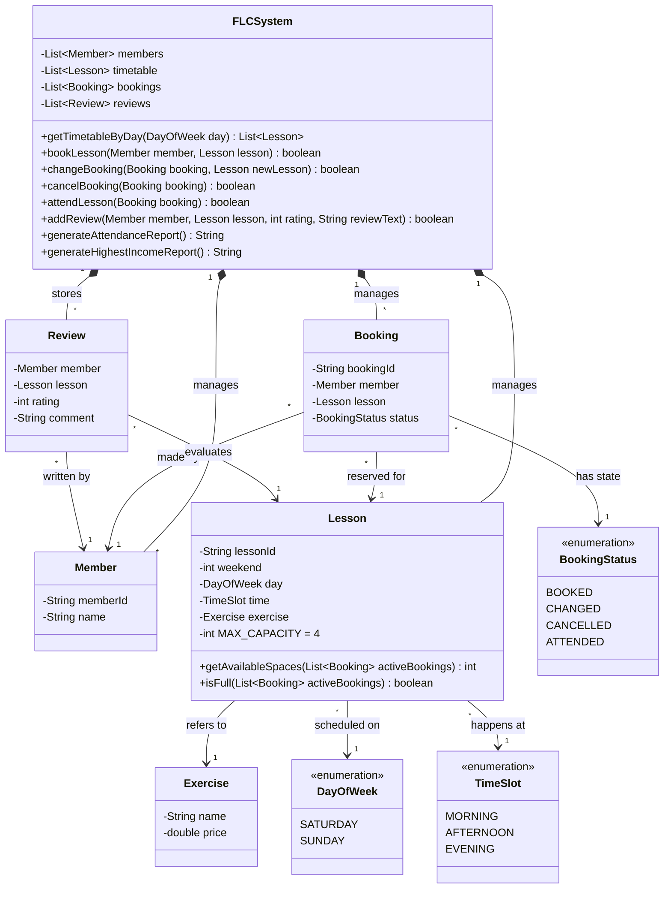

# Furzefield Leisure Centre (FLC) Booking System

This is a complete, decoupled group exercise booking system built in Java. It dynamically handles class capacity limitations, prevents timeslot conflicts, requires explicit attendance for reviews, and generates automated income and attendance reports.

## System Design (UML)



## How to Compile and Run
You can quickly run the software and print out the core dynamic reports via the terminal using basic Java compilation:
```bash
mkdir -p out
javac -d out src/main/java/com/flc/*.java
java -cp out com.flc.Main
```

## How to Run Automated JUnit Tests
The logic governing Capacity limits, Time Conflicts, and Booking States is backed by an automated suite. To run it:
```bash
mvn clean test
```

## Strict Business Constraints Met
- **Booking Lifecycle:** Enforced `BookingStatus` (BOOKED, CHANGED, CANCELLED, ATTENDED).
- **Time Conflicts:** Mathematical restrictions against a user booking different lessons at the same time limit.
- **Review Integrity:** Enforced rule checking that a user has `ATTENDED` a `BOOKED` class before leaving a review.
- **Reporting Integrity:** Income counts `BOOKED / ATTENDED` users. Attendance purely counts `ATTENDED` users.
